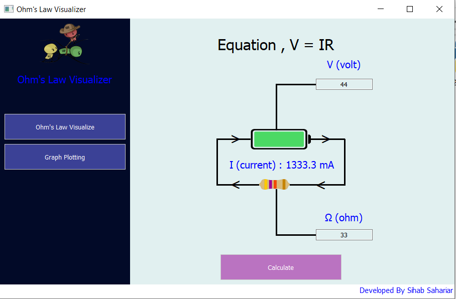
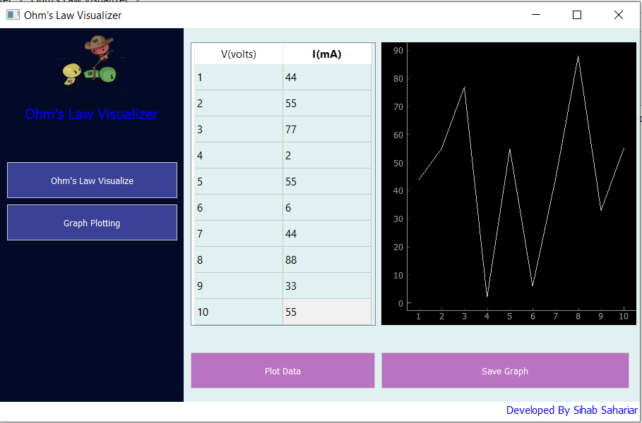

<<<<<<< HEAD
# dotslash-repo   

## Welcome to the dotslash Hackathon Repository! - Digital Outlaws 🚀
## Educational
### Instructions:
- **Fork this repository**: Only one member from each team must fork this repository to their own GitHub account.
- **Commit directly to your fork**: All submissions, code, and documentation must be committed to your fork. This repository will serve as your primary workspace during the hackathon.

- [Rulebook and Sponsor Problem Statements](https://tanmayrainanda.craft.me/dotslash-info-repo)
---

## Requirements

1. **Pitch Deck**  
   - All submissions must include a **pitch deck** explaining your idea and its implementation.  
   
2. **Well-Commented Code**  
   - Ensure that all code is well-documented with comments and follows standard coding practices.  
   
3. **Mid-Hack Folder**  
   - Create a folder named `mid-hack` in your fork. This folder should contain all materials required for the **mid-hack submission**, including progress updates, initial implementation, and any supporting files.  

4. **Citation File**  
   - Include a `citations.md` file in your repository. All external resources (e.g., articles, tutorials, code snippets) must be properly cited here. Failure to do so may result in your project being flagged for plagiarism.

5. **End-Hack Folder**  
   - Create a folder named `end-hack` in your fork. This folder should contain all materials for the **final submission**, including the completed project, pitch deck, and any supplementary resources.

---

## Suggestions for Participants

1. **Maintain Clean and Consistent Code**  
   - Use comments and docstrings to document your code.  
   - Follow a consistent naming convention for files, functions, and variables to improve readability.

2. **Commit Regularly**  
   - Push commits frequently rather than submitting a single large commit at the end.  
   - This practice not only showcases your progress but also helps in avoiding plagiarism issues.

3. **Version Control Best Practices**  
   - Use branches for major features or experimental changes and merge them into the main branch after testing.  
   - Write clear, concise commit messages for better traceability.

4. **Utilize GitHub Issues and Pull Requests**  
   - Track tasks and discussions using GitHub Issues.  
   - Use Pull Requests (PRs) to review and merge changes within your team. This will help in maintaining a collaborative workflow.

---

## Submission Guidelines

- **Mid-Hack Checkpoint**  
  Submit the contents of your `mid-hack` folder by the designated checkpoint time. This will include progress updates and preliminary work.

- **Final Submission**  
  Ensure that all files for your final project are stored in the `end-hack` folder. Your pitch deck and `citations.md` file must also be updated and included here.  

---

## Resources

1. **Git and GitHub Basics**  
   - If you’re new to Git, check out these resources:  
     - [Git Documentation](https://git-scm.com/doc)  
     - [GitHub Guides](https://guides.github.com/)  

2. **Project Ideas**  
   - Explore hackathon project examples for inspiration:  
     - [DevPost](https://devpost.com/)  
     - [Awesome Hackathon Projects](https://github.com/daveverwer/awesome-hackathon-projects)  

---

## Code of Conduct


By participating in this hackathon, you agree to follow the event’s Code of Conduct. Be respectful, inclusive, and ensure a positive experience for all participants.  

#About Idea
Revolutionizing Science Education for Rural Students: Virtual Labs for a Hands-On Experience!

Relevance of the Problem & Impact: In rural areas, students often miss out on one of the most exciting parts of learning science: practical experiments. Without proper labs, they struggle to fully grasp key concepts. Our virtual lab bridges this gap, offering an interactive, hands-on learning experience, no matter where students are located. With our solution, they can experiment, learn, and explore just like their peers in well-equipped schools, unlocking their potential for a brighter future.

Preliminary Research: Rural students face a major hurdle: a lack of infrastructure and resources for practical science education. Many schools rely on textbooks and theory, leaving practical knowledge out of reach. While there are a few digital alternatives, they often fall short in engagement and interactivity. That’s where our virtual lab comes in.

Proposed Methodology & Innovation: Imagine conducting science experiments at the click of a button! Our platform offers interactive 3D simulations for Physics, Chemistry, and Biology experiments, designed to replicate real-life scenarios. No special hardware is required—students just need an internet connection. With intuitive step-by-step guides, real-time feedback, and the ability to analyze results, learning becomes an adventure rather than a chore. Plus, built-in quizzes ensure that students not only perform but also understand the science behind each experiment.

Team Collaboration & Planning: Our talented team of developers, educators, and designers is dedicated to creating a seamless, engaging experience. Using cutting-edge web technologies like Three.js, HTML5, and JavaScript, we’ll deliver an interactive lab that runs smoothly on all devices. Starting small with core experiments, we’ll gradually expand our virtual offerings, ensuring that students are always challenged, always learning, and always engaged.

For any queries or support, feel free to contact the organizing team.  The full code of conduct can be found at [Fest Website](https://www.fitoorxprayas.in/rules)

Happy hacking! 🎉
=======
# Ohm-s-Law-Visualizer
It's an application to calculate I from v and r using Ohm's Law. It can also plot a graph between V vs I. 

# Story
I'm doing my Undergrad in CSE at BRAC University. In Fall 2021, I'm doing Physics Course (PHY112). Because of COVID pandemic, we are attending class from home. So, our lab classes are being coducted online. To simulate Ohm's Law , we are using [https://phet.colorado.edu/en/simulations/ohms-law] and that's my inspiration to create my own tool like that. So I created this tool. One thing more, in my software I've also added the graphing tool to complete my lab assignment at the same time using the same software which eventually saved my times. 

# How to Run?
Install these dependecy first. 
```
pip install PyQt5
pip install pyqtgraph
```
now run the main file.
```
python main.py
```

# Screenshot


>>>>>>> 8757919 (Add 3D models and basic chatbot implementation for Ohm's Law project)
